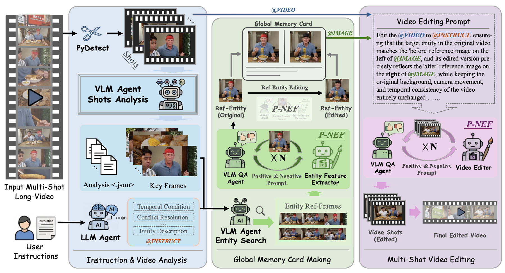
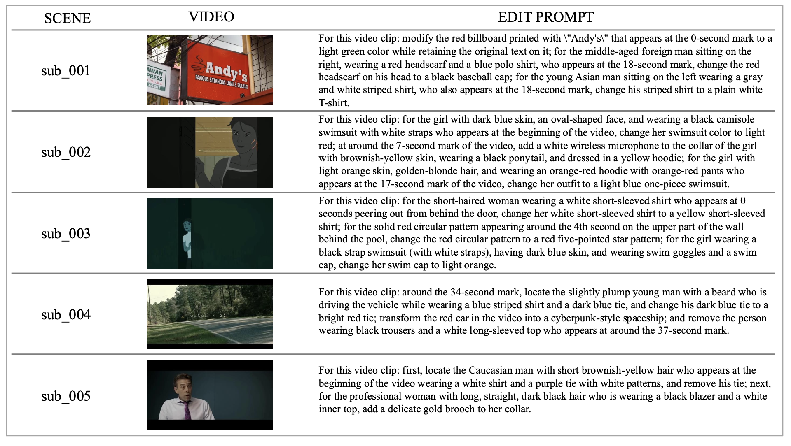
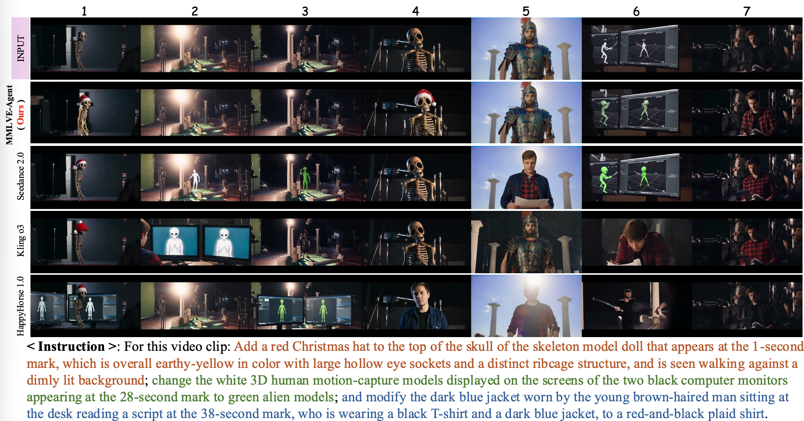
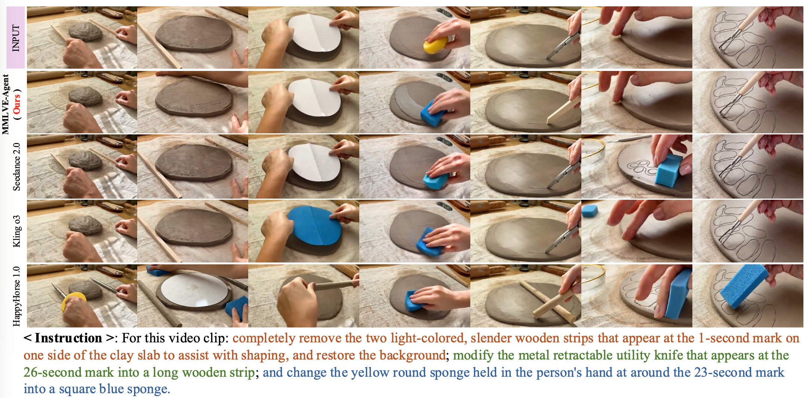

# MMLVE-Agent

### Thinking on Shots: Consistent Multi-Shot Video Editing with Agentic Reasoning<sup>&ast;</sup>

> **Chenyang Wu**<sup>1,†</sup>, **Fuchen Long**<sup>2,†</sup>, Binyuan Huang<sup>2</sup>, Xinlong Sun<sup>2,‡</sup>, Xi Chen<sup>2</sup>, Chun-Le Guo<sup>1</sup>, Chongyi Li<sup>1,§</sup>
> <br/><sup>1</sup>VCIP, CS, Nankai University &nbsp;&nbsp; <sup>2</sup>Smart Creation Platform Department, Online Video BU, Tencent
> <br/><sup>&ast;</sup>Work done during the Tencent Qingyun Program internship.
> <br/><sup>†</sup>These authors contributed equally. &nbsp;&nbsp; <sup>‡</sup>Project Leader. &nbsp;&nbsp; <sup>§</sup>Corresponding Author.

<p align="left">
  <a href="https://wucy0519.github.io/MMLVE/"></a>
  <a href="https://arxiv.org/abs/2608.26809"></a>
  <a href="https://huggingface.co/datasets/wcy1234567/MMLVE-Bench"></a>
  
</p>

Edit real-world **multi-shot long videos** with a single natural-language instruction.
The agent understands *who* and *what* to change, tracks the target entity across every
shot, and propagates a consistent edit through the whole video — preserving
identity, background, and camera motion.

> Example: `"Change the man's red shirt to blue"` → every shot containing that
> man is edited, other people and objects stay untouched.

---

## Overview

While generative AI has greatly advanced video editing, existing methods focus on
**single-shot** or short clips. Editing long videos with **multiple instructions**
is far harder: naive fixed-duration chunking causes **entity fragmentation**, severe
**editing hallucinations**, and **broken temporal continuity**.

This project introduces the **Multi-Instruction Multi-Shot Long-Video Editing
(MMLVE)** task, built around three core objectives:

- **CSEC** — *Cross-Shot Editing Consistency*: keep the edited entity's identity
  consistent across all shots.
- **MID** — *Multi-Instruction Decoupling*: execute diverse instructions
  independently, without mutual interference.
- **ZDSS** — *Zero-Destruction on Spatiotemporal Structure*: leave un-targeted
  regions, backgrounds, and camera motion untouched.

To tackle these, **MMLVE-Agent** is a heterogeneous multi-agent framework that
combines **LLMs** and **VLMs** for shot-level video decoupling and precise
instruction parsing. Two key mechanisms drive its quality:

- **Global Memory Card** — a global visual editing anchor (a top-*k* keyframe
  reference grid synthesized into a canonical reference) that guarantees CSEC & MID
  across arbitrary physical shots.
- **Pos-Neg Editing Feedback (P-NEF)** — a VLM evaluator emits *both* a negative
  prompt (to correct errors) and a positive prompt (to balance attention), enabling
  autonomous self-correction and monotonic quality improvement.

We further build **MMLVE-Bench**, a dataset with complex real-world spatiotemporal
dynamics, high-density heterogeneous instructions, and sparse/random entity
distributions, and evaluate with three MMLVE-focused metrics (CSEC / MID / ZDSS).
Extensive experiments show MMLVE-Agent outperforms closed-source SOTA approaches
(e.g., Seedance 2.0), eliminating editing hallucinations while preserving cross-shot
consistency and seamless spatiotemporal transitions.

### Framework

The full pipeline: shot boundary detection + LLM instruction parsing → per-shot VLM
analysis → Global Memory Card making (with P-NEF) → reference-guided video editing &
propagation → assembly.

<p align="center">
  
</p>

### Results

Qualitative editing results of MMLVE-Agent on complex multi-shot long videos:

<p align="center">
  
</p>

Comparison against baseline models (Seedance 2.0, Kling o3, HappyHorse 1.0). Only
MMLVE-Agent simultaneously achieves CSEC, MID, and ZDSS — baselines suffer from
cross-shot "amnesia", identity morphing, and destruction of un-targeted content:

<p align="center">
  
</p>
<p align="center">
  
</p>

---

## How It Works

```
Input video + natural-language prompt
    ↓
Module 1  Instruction parsing
          NL → structured edits (entity, action, time condition)
          → entity_instru.json
    ↓
Module 2  Video grounding
          Shot/scene cut detection (PySceneDetect)
          + per-shot VLM analysis (plot, keyframes, missed sub-cuts)
          + event grounding: which scenes match the time condition
          → time_instru.json, shots_analysis.json
    ↓
Module 3  Entity reference building
          Pick the best keyframe sightings of the target entity
          → synthesize a clean front-view reference
          → apply the edit to that reference (the "canonical" before/after pair)
          → entity_refs/
    ↓
Module 4  Video editing & propagation
          Per scene: derive the edit operation, run reference-guided V2V editing,
          then VLM quality check on keyframe grids (retry on failure)
          → edited_clips/
    ↓
Module 5  Assembly
          ffmpeg stitch + audio mux → final_output.mp4
```

Every module writes checkpoints to the workspace, so re-running the same command
resumes instead of redoing paid API calls.

---

## Setup

### 1. Prerequisites

- **Python 3.10+**
- **ffmpeg** (`ffmpeg` and `ffprobe` on `PATH`)

```bash
brew install ffmpeg        # macOS
sudo apt install ffmpeg    # Ubuntu
```

### 2. Install dependencies

```bash
pip install -r requirements.txt
```

### 3. Configure API keys

Copy the template and fill in your own keys — **all API values ship empty**:

```bash
cp env.example.sh env.sh   # then edit env.sh
```

Two backends are required:

| Purpose | Variable | Where to get it |
|---|---|---|
| Text / vision / image | `OPENAI_API_KEY` | Any OpenAI-compatible provider |
| Video editing (V2V) | `BYTEPLUS_API_KEY` | [BytePlus ModelArk console](https://console.byteplus.com/ark) |

The LLM side speaks the standard OpenAI `chat/completions` protocol, so you can
point it at whichever provider you prefer:

```bash
# OpenAI
export OPENAI_API_KEY="sk-..."
export OPENAI_BASE_URL="https://api.openai.com/v1/chat/completions"
export LLM_TEXT_MODEL="gpt-4o-mini"
export LLM_VISION_MODEL="gpt-4o-mini"
export LLM_IMAGE_MODEL="gpt-image-1"

# Google Gemini (OpenAI-compatible endpoint)
export OPENAI_API_KEY="AIza..."
export OPENAI_BASE_URL="https://generativelanguage.googleapis.com/v1beta/openai/chat/completions"
export LLM_TEXT_MODEL="gemini-2.5-pro"
export LLM_VISION_MODEL="gemini-2.5-pro"
export LLM_IMAGE_MODEL="gemini-2.5-flash-image"
```

> The image model must support **image editing / inpainting with reference
> images**, otherwise keyframe editing quality will degrade.

---

## Quick Start

```bash
cd /path/to/MMLVE-Agent
source env.example.sh

python -m video_editing_agent.run_agent \
  --video /path/to/input.mp4 \
  --prompt 'Change the man in the red shirt into a blue shirt' \
  --workspace ./workspace/run_001
```

Result: `./workspace/run_001/final_output.mp4`

### Try it without spending API credits

```bash
python -m video_editing_agent.run_agent \
  --video input.mp4 --prompt 'test' --workspace ./workspace/dev --dev-mode
```

`--dev-mode` skips all paid API calls and uses local placeholders — useful for
validating the pipeline, scene detection, and workspace layout.

---

## CLI Options

| Flag | Default | Description |
|---|---|---|
| `--video` | *required* | Input video path |
| `--prompt` | *required* | Natural-language edit instruction |
| `--workspace` | `./workspace` | Output directory for artifacts and the final video |
| `--dev-mode` | off | Skip all paid API calls (local placeholders) |
| `--scene-mode` | `hybrid` | Shot detector: `content`, `adaptive`, `hybrid` |
| `--scene-threshold` | `27.0` | Lower = more cuts detected |
| `--scene-min-len` | `8` | Min frames between cuts |
| `--extract-fps` | `8.0` | Frame extraction FPS |
| `--max-concurrency` | `2` | Parallel scene edits |
| `--no-resume` | off | Re-run all modules, ignoring checkpoints |
| `--no-keyframe-edit-qa` | off | Disable VLM quality check after keyframe editing |
| `--no-mask-visibility-prefilter` | off | Check every instruction on every frame |
| `--log-file` | none | Also write logs to a file |

---

## Workspace Layout

```
workspace/run_001/
├── entity_instru.json          Module 1 — structured edit instructions
├── time_instru.json            Module 2 — scenes matched to the time condition
├── shots_analysis.json         Module 2 — per-shot VLM analysis
├── shots/                      Module 2 — detected shot clips
├── scenes/                     Module 2 — scene frames
├── entity_refs/                Module 3 — entity reference before/after pairs
├── edited_clips/               Module 4 — edited scene clips
└── final_output.mp4            Module 5 — final result
```

---

## Configuration

All tuning knobs live in `env.example.sh`. The most useful ones:

| Variable | Default | Description |
|---|---|---|
| `VIDEO_MODEL` | `seedance-1-5-pro-251215` | Video editing model |
| `VIDEO_RESOLUTION` | auto | Force `480p` / `720p` (auto-detected from source) |
| `VIDEO_POLL_TIMEOUT` | `1000` | Max seconds to wait for one video task |
| `VIDEO_CHUNK_MAX_SEC` | `10` | Long scenes are edited in chunks of this length |
| `KEYFRAME_EDIT_QA` | `true` | VLM check after keyframe editing |
| `VIDEO_EDIT_QA` | `true` | VLM check after video propagation |
| `SCENE_DETECT_MODE` | `enhanced` | `content` / `adaptive` / `hybrid` / `enhanced` |
| `SCENE_DETECT_THRESHOLD` | `22` | Lower = more sensitive cut detection |
| `LLM_MAX_VISION_IMAGES` | `8` | Max images per vision request |

---

## Troubleshooting

| Symptom | Fix |
|---|---|
| `OPENAI_API_KEY is not set` | `source env.example.sh` after filling in the key |
| `BYTEPLUS_API_KEY is not set` | Required for real video output; or use `--dev-mode` |
| `No module named 'scenedetect'` | `pip install -r requirements.txt` |
| `ffprobe not found` | Install ffmpeg and ensure it is on `PATH` |
| Target entity not found in a shot | Make the prompt more specific (colour, position, clothing) |
| Video task times out | Raise `VIDEO_POLL_TIMEOUT`, or lower `VIDEO_CHUNK_MAX_SEC` |
| Want to redo a run | Delete the workspace, or pass `--no-resume` |

---

## Acknowledgements

This project is built on top of the pipeline design of
**[Soap2Soap](https://github.com/showlab/Soap2Soap)** — its video analysis,
keyframe consistency, and reference-guided generation ideas laid the foundation
for this agent. Many thanks to the authors for open-sourcing their work.

---

## Citation

If you find this work useful, please consider citing:

```bibtex
@article{wu2026thinking,
  title   = {Thinking on Shots: Consistent Multi-Shot Video Editing with Agentic Reasoning},
  author  = {Wu, Chenyang and Long, Fuchen and Huang, Binyuan and Sun, Xinlong and Chen, Xi and Guo, Chun-Le and Li, Chongyi},
  journal = {arXiv preprint arXiv:2608.26809},
  year    = {2026}
}
```

---

## License

MIT
